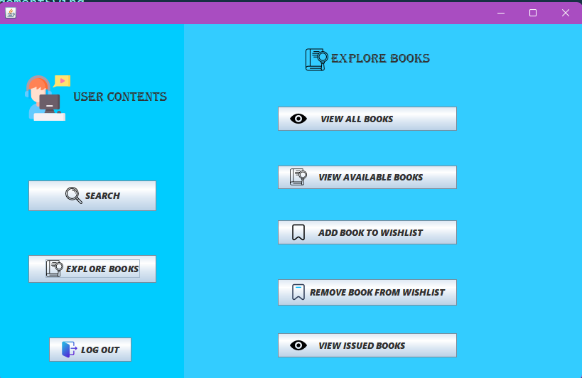

# 📚 Library Management System

Welcome to the Library Management System project! This application is designed to manage library operations efficiently. Below are the features implemented in this project:

## Features

1. ✅ **Setup Database Tables**
2. ✅ **Admin Login**
3. ✅ **User Login**
4. ✅ **Registration**
5. ✅ **Recover Password**
6. ✅ **Add Book**
7. ✅ **Delete Book**
8. ✅ **Update Book**
9. ✅ **List All Books**
10. ✅ **List Available Books**
11. ✅ **Issue Book**
12. ✅ **View Issued Books for Admin**
13. ✅ **Return Book**
14. ✅ **Search Book by Title**
15. ✅ **Search Book by Author**
16. ✅ **View All Books**
17. ✅ **View Available Books**
18. ✅ **Add Book to Wishlist**
19. ✅ **Remove Book from Wishlist**
20. ✅ **View Issued Books for Users**

## 🛠️ Technologies Used

- **Apache NetBeans IDE 23**
- **MySQL Database**
- **JSwing for GUI**

## 📋 Prerequisites

To run this project, you need to have the following setup:

- MySQL Database with:
  - **User**: `root`
  - **Password**: `root`
  - **Port**: `3306`
  - **Database**: `librarymanagement`

## 🚀 Getting Started

1. **Clone the repository**:
   ```bash
   git clone https://github.com/sachinanand99/LibraryManagementSwing.git
   cd LibraryManagementSwing
2. **Set up the database**:
    - Create a database named librarymanagement.
    - Import the provided SQL script to set up the tables.
3. **Open the project in Apache NetBeans IDE 23**:
    - Open Apache NetBeans IDE.
    - Open the project folder.
4. **Run the project**:
    - Build and run the project from the IDE.

## 📖 Usage

- **Admin Login**: Admin can log in to manage books and view issued books.
- **User Login**: Users can log in to issue books, view issued books, and manage their wishlist.
- **Registration**: New users can register to access the library system.
- **Recover Password**: Users can recover their password if forgotten.
- **Book Management**: Admin can add, delete, update, and list books.
- **Issue and Return Books**: Users can issue and return books.
- **Search Books**: Users can search for books by title or author.
- **Wishlist**: Users can add or remove books from their wishlist.

## 📷 Screenshots


## 🤝 Contributing
Contributions are welcome! Please fork the repository and submit a pull request.

## 📄 License
This project is licensed under the MIT License.